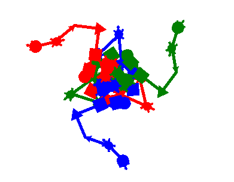
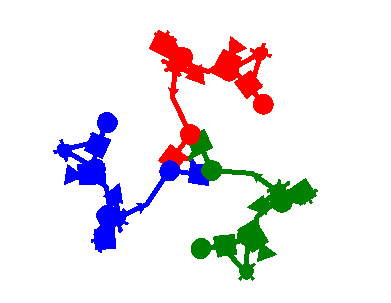

----------------------------------------------------------------------

# Kaleidoscope

----------------------------------------------------------------------

### Objectives

1. Use functional programming
2. Use range alone and as part of a for-loop.
3. Use the random and turtle modules.

### Instructions

Write a program using the python turtle that creates a kaleidoscope image.

Use this python turtle document: <https://docs.python.org/3/library/turtle.html>

- Import turtle and random modules
- You will need a minimum of 8 functions.
- Create a minimum of <span style="color:red">4</span> turtle objects. Each object should be created in its <u>own function</u> and then returned. (at least 4 functions)

Example of creating a turtle object named turtle1:

```
turtle1 = turtle.Turtle()
```

- Create functions that move/change all of your objects that take as parameters turtle objects. (at least 3 functions)

Example function for move if I had two turtle objects named turtle1 and turtle2:

```
def move(turtle1,turtle2):
    dist = random.randrange(-50,50)
    turtle1.forward(dist)
    turtle2.forward(dist)
```

Write a main function that:

- Calls the functions that create your turtle objects and catches the return value.
- Uses for-loops with range() to create designs.
- Uses the randrange() function in the random module to make the designs randomly generated.
- Calls functions to move/change your objects.

### Pass Off

You pass this off by showing the Labbies your working code.

You also need to submit your code and two images of what your code created. See the examples below.



